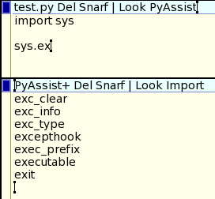
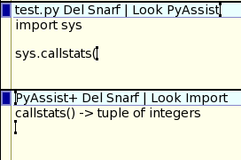

#NAME
lab 103 - python content assist

#NOTES
Building on lab 102 I've started to write an acme client for python content-assist in python. I read the code for python's IDLE editor and pulled some pieces out of that to help with my implementation. The AutoComplete.py and CallTip.py modules are copied out of idlelib and reduced to just the functions I needed.

Just as in lab 102 the acme client is implemented using pyxp to connect to the acme file system.

In an acme editor window execute PyAssist. Start typing some python. After typing a dot the client will display available attributes for the module. Continue typing and it will reduce the list to those names with a matching prefix. Press the Tab key to complete a name or prefix depending on whether there is one or more names.

After typing an open parenthesis the client will show the call tip for the function.

The client implements an Import command so that more python modules can be added to the namespace. PyAssist doesn't attempt to parse the edited script. Idlelib includes code that could help to do this. But for now you need to pass a module name as argument to the Import command.

A next step for python integration to acme is to implement a debugger. Python comes with libraries for this too, so a debugger similar to the acme debugger adeb should be a future lab. I might then run edited scripts in a sub shell and inspect that process' namespace similar to the IDLE implementation, so that content-assist adapts to the script being edited.
