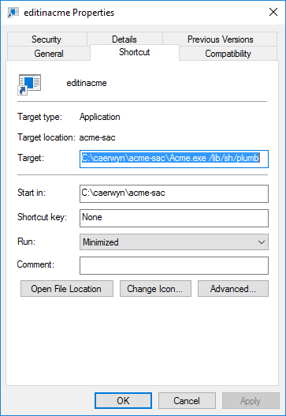

#  NAME
lab 112 - editinacme

#  NOTES
Create a command to add to the Windows "Send To" menu so I can send files to Acme SAC plumber from inside Windows Explorer. This has been done before using the B command for sam editor and `editinacme` for Acme from Plan 9 from User Space.

I'll be using a a shortcut to Acme.exe in the "Send To" folder. It needs to avoid the usual Acme start up and instead mount Acme's styx service, bind the plumber to /chan and send the arguments from the command line to the plumber.

By convention inside Acme-SAC windows paths "C:\file name" are mapped to "/n/C/file␣name".  This is represented in the plumbing rule:

    # Microsoft Windows file names
    kind is text
    data matches '(^[a-zA-Z]):(.*)'
    plumb alwaysstart acme
    plumb start /dis/sh.dis -c 'plumb -d edit /n/^$1^`{echo $2 | tr ''\\ '' /␣}'

I added a new script /lib/sh/plumb to will be launched by the cell command to send the data to the Acme plumber

    #!/dis/sh
    ndb/cs
    mount -A 'tcp!localhost!styx' /n/remote
    bind /n/remote/chan /chan
    plumb  $*
    echo halt > /dev/sysctl

The final step is to create a shortcut to the Acme.exe command with the necessary arguments and place the shortcut in the "Send To" folder.  

 

Open the Windows explorer and in the address bar type `shell:sendto`. Create a shortcut with the name 'editinacme'. The shortcut will have the target `Acme.exe /lib/sh/plumb` and have it start in the root of your acme-sac folder.  Also set the property to have it run minimized.

You should now be able to select a file in Windows Explorer and open the menu Send To and select editinacme. 

