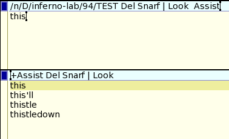

# NAME
lab 94 - acme content assist

# NOTES
This lab explores a way of implementing content assist for acme. I've focused on the user interface and how that might work inside acme and not specific language support.

The command is called Assist. Launch it within an editor window and it will provide assistance for that window only. A new window will open and while you type in the edit window Assist will attempt to match the currently typed word against the content of /lib/words using the command look(1). The results are displayed in the +Assist window.

With results in the +Assist window and with focus still in the editor window type Ctrl-l to step down through the results. Each result will be selected in turn and the selection will wrap around to the top. To choose a selection and replace the currently edited word with the selected text type Ctrl-k.

The Assist command also supports file completions. Start typing a path in the edit window and type Ctrl-y to show file completions in the +Assist window. Use Ctrl-l and Ctrl-k to navigate and select from the results.

Assist assumes /lib/words exists and is the default for finding word completions. You can download a copy of /lib/words from plan9port. You can also run Assist with a filename for your own list of words. It should follow the format expected by look(1).

Some interesting things about the implementation. Acme isn't aware of the control keys. It adds the control character to the document and the Assist plugin reads it and removes it from the document. In this way plugins can define their own special keys as long as acme does not already process them in some special way (see table below).

The Assist plugin does cause the editor window to change its behaviour slightly. Assist has to resend all events so that normal editor commands like Put and Undo are understood. However, because we've opened the event file the normal refresh of the tag line with Undo and Put when the file is dirtied does not happen.

The +Assist window is off to the side, or it could be placed just below the edit window. This is pretty good. But your eye does need to travel to see completion suggestions. Maybe not as ideal as the info popup appearing just below the cursor position. However, this method fits in far better to the acme model.

Special Keys
While working on this I thought I'd map out the control keys already understood by acme. The ASCII control characters are mostly passed through to the document. However, a number are interpreted by acme in a special way. In the table below NA, non-assigned, means they have their standard ASCII assignment.

	Ctrl Key	Description
	a	move cursor to beginning of line
	b 	NA
	c 	copy
	d 	NA (eof)
	e 	move cursor to end of line
	f 	file completion
	g 	NA
	h 	delete
	i 	tab
	j 	NA (carriage return)
	k 	NA                
	l 	NA                   
	m 	newline
	n 	NA
	o 	NA
	p 	move cursor to beginning of document
	q 	move cursor to end of document
	r 	NA
	s 	NA     
	t 	NA
	u 	delete to start of line
	v 	paste
	w 	delete to start of word
	x 	cut
	y 	NA
	z 	undo
	[ 	escape
	\ 	NA
	] 	NA
	^ 	NA
	_ 	NA
	? 	?

There are also mappings for the Home keys. These mappings are for the acme editor window in the most recent commits to acme-sac (the up/down arrow have been changed compared to other acmes).

	Key	Description
	Home	scroll to beginning of document
	End	scroll to end of document
	PgUp	scroll page up
	PgDown	scroll page down
	Left Arrow	move cursor left one char
	Right Arrow	move cursor right one arrow
	Up Arrow	move cursor up one line
	Down Arrow	move cursor down one line

None of the function keys are interpreted or even passed to the console on windows inferno. The escape key has some special meaning, it selects the last entered text, or cuts the selected text if text is selected. The Alt key is also used for entering unicode keys.
