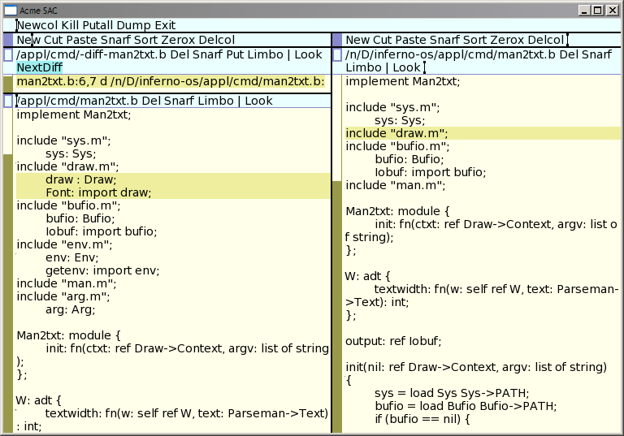

#NAME
lab 95 - acme side-by-side diff

NOTES
Here's a script I wrote to help do side-by-side diffs in Acme. Run adiff as normal inside acme. And then in the adiff output window type the command NextDiff. Executing this command will step through each diff in the adiff output and highlight the changed region in each file.

The script will highlight each line, avoiding the cursor jump to highlighted regions as happens by plumbing or right-clicking on a file pattern. Though the cursor jump will occur the first time the diffed files are opened, for subsequent execution of NextDiff for diffs within the same files the cursor will remain over the NextDiff command and the highlighted regions will change with file scrolling to show at least part of the changed regions.

When the files first open you'll still need to manually arrange the files side by side. There is no acme API for window placement. However, the command will save some amount of scrolling, clicking, and mouse movement within the adiff output.

Here's the script for acme-sac. Some slight changes might need to be made for inferno, and something very similar should work in p9p acme.

	#!/dis/sh
	
	fn findwin {
	 file = $1
	 < /mnt/acme/index getlines {
	  (w x y z zz f rest) := ${split ' ' $line }
	  if {~ $f $file} {echo $w}
	 }
	}
	
	fn highlight {
	 file = $1
	 lineno = $2
	 a := `{findwin $file}
	 if {! ~ $#a 0} {
	  cd /mnt/acme/$a
	  <> addr {
	   echo -n $lineno > addr
	   echo 'dot=addr' > ctl
	   echo show > ctl 
	  }
	 }{
	  plumb $file:$lineno
	 }
	}
	
	cwd = `pwd
	cd /mnt/acme/$acmewin
	{
	 echo -n 'addr=dot' >ctl
	 (a b) := `cat 
	 echo -n '/^[^\-<>].*\n/' > addr
	 echo -n 'dot=addr' > ctl
	 echo -n show > ctl
	 (f1 cmd f2) := `{getline data}
	 (f1 l1) = ${split ':' $f1}
	 (f2 l2) = ${split ':' $f2}
	 f1 = `{cleanname -d $cwd $f1}
	 f2 = `{cleanname -d $cwd $f2}
	 highlight $f1 $l1
	 highlight $f2 $l2
	} <> addr

The findwin and highlight functions I have used before in the acme debugger interface, adeb, in /appl/acme/acme/debug/adeb.b.
