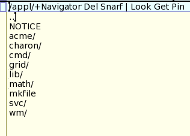

# NAME
lab 97 - acme Navigator

# NOTES
I created a simple directory browser for acme. Called Navigator, it opens directories in the same window. This makes descending deep but unfamiliar directory hierarchies easier because it avoids the proliferation of windows that clutter the desktop.

The client understands the command Pin for creating a standard acme directory window for the current directory (to pin the current directory to the desktop). This is an example for a rather simple client for acme.
