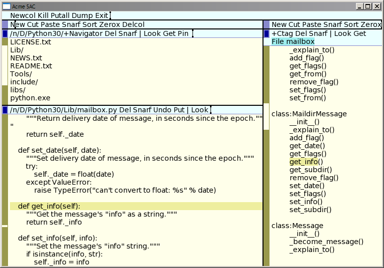

# NAME
lab 98 - acme Ctag

# NOTES
Ctag is a new client for acme that reads the tags file generated by ctags. In particular I worked with Exuberant Ctags on windows. While working on acme content-assist in lab 94 I thought a next possible step was using ctags for code completion. So in writing this program I wanted to explore using exuberant ctags by doing something easier, that is by providing assistance with code navigation.

Exuberant ctags understands many languages, but for the current effort I tried it on Java and Python.

For example, I generated tags for the python standard libraries,

	cd:/Python30
	ctags -R --excmd=number --exclude=test

Then run the client on the tags file,

	Ctag /n/D/Python30/tags
	
What you start with is a blank window. In the tagline is a File command. Give it an argument of a filename which it will grep for in the ctags file.

	File mailbox
	

It will then show all classes and methods within matching files. You can right-click on a method name to open the file at the line where the method is defined.

Ctag gives a top down view of a project. It is like the Outline view of some IDEs. A next step would be to implement the reverse direction, but probably as part of the content assist.
